**WSPR beacon on breadboard**

[link to hamprojects web site](https://hamprojects.wordpress.com/2019/06/02/wspr-beacon/)

*f4goh@orange.fr*

**Add FST4W and new library for OLED**

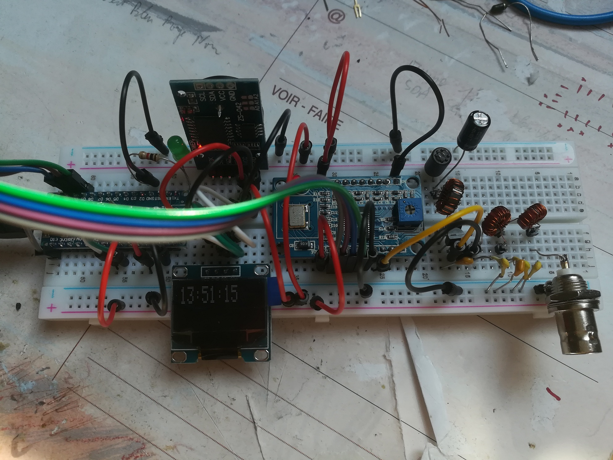

## Wiring ##

- Wire the schematics below

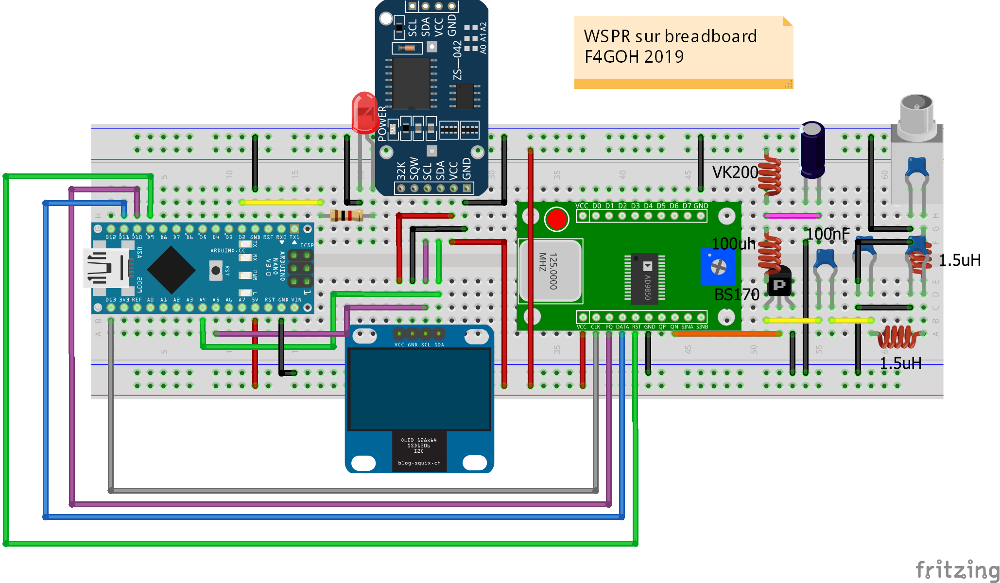

- Adjust output filter as filter design calculation

[filter design](http://tonnesoftware.com/svcfilter.html) 

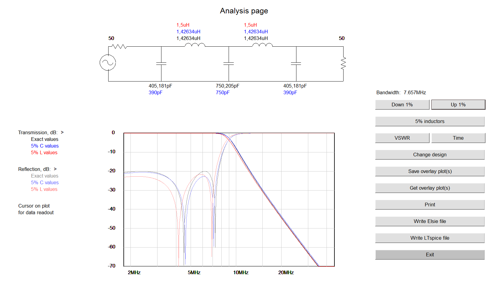

- Use mini tore calculator to find inductor turns

[mini tore calculator](https://constructions.f6fkn.com/downloads/minirk12-install.exe) 

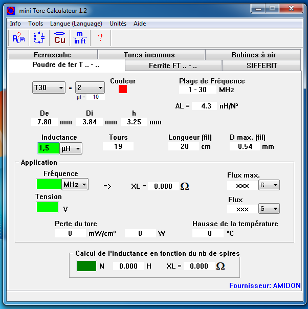

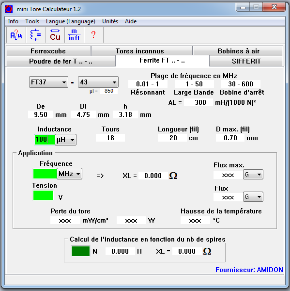

- Check filter with a VNA (optional)

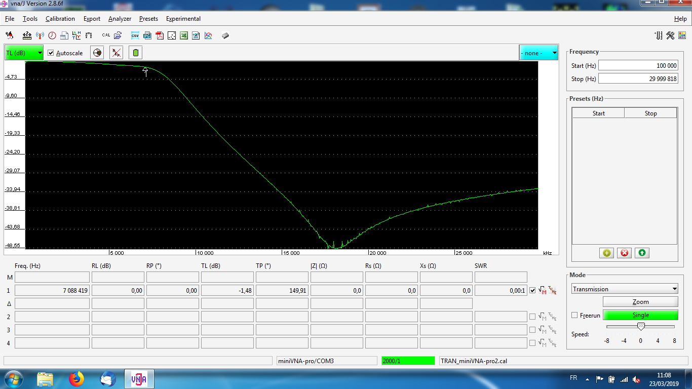

## Programming ##

- Copy libraries files into Arduino/library folder

- run wspr.bat put your callsign, locator and power and generate symbols.

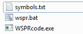

- Paste symbols from symbols.txt into WsprSimple.ino with commas

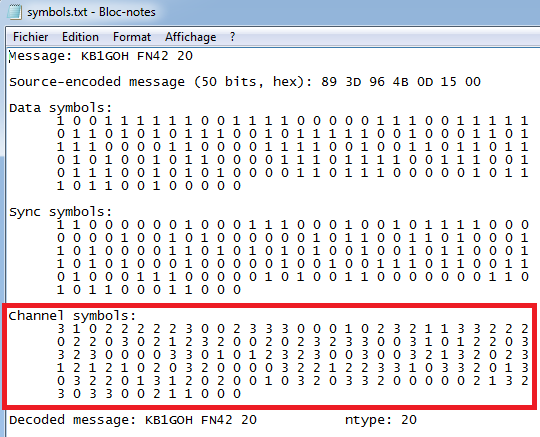


```c++
	int wsprSymb[] = {3, 3, 0, 0, 0, 2, 0, 2, 1, 2, 0, 2, 3, 3, 1, 0, 2, 0, 3, 0, 0, 1, 2, 1, 1, 3, 1, 0, 2, 0, 0, 2, 0, 2, 3, 2, 0, 1, 2, 3, 0, 0, 0, 0,
	                  2, 2, 3, 0, 1, 3, 2, 0, 3, 3, 2, 3, 2, 2, 2, 1, 3, 0, 1, 0, 2, 0, 2, 1, 1, 2, 1, 0, 3, 2, 1, 2, 3, 0, 0, 1, 2, 0, 1, 0, 1, 3, 0, 0,
	                  0, 1, 3, 2, 1, 2, 1, 2, 2, 2, 3, 0, 0, 2, 2, 2, 3, 2, 0, 1, 2, 0, 3, 3, 1, 2, 3, 3, 0, 2, 1, 3, 0, 3, 2, 2, 0, 3, 3, 1, 2, 0, 0, 0,
	                  2, 1, 0, 1, 2, 0, 3, 3, 2, 2, 0, 2, 2, 2, 2, 1, 3, 2, 1, 0, 1, 1, 2, 0, 0, 3, 1, 2, 2, 2
	                 };
```

- Adjust frequency

```c++
#define frequence 7040100
long factor = -1500;
```

## Usage notes ##
	
- Program Arduino Nano
- Adjust RTC clock by typing "h" key on serial monitor

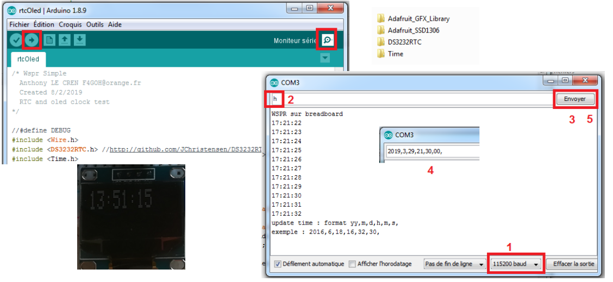

- Connect any HF antenna

Beacon transmit every 2 min, monitor transmission with your receiver and 
adjust frequency "factor" offset if there is outside the WSPR band

- Enjoy WSPR beacon.

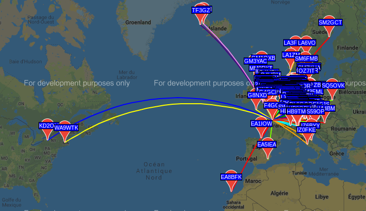

the src directory contains other programs like :

- Rtty, PSK, QPSK, Hellschreiber, JT65, JT9, WSPR and FT8 encoding exemples

- And [FSQCall](https://www.qsl.net/zl1bpu/MFSK/FSQweb.htm) beacon test

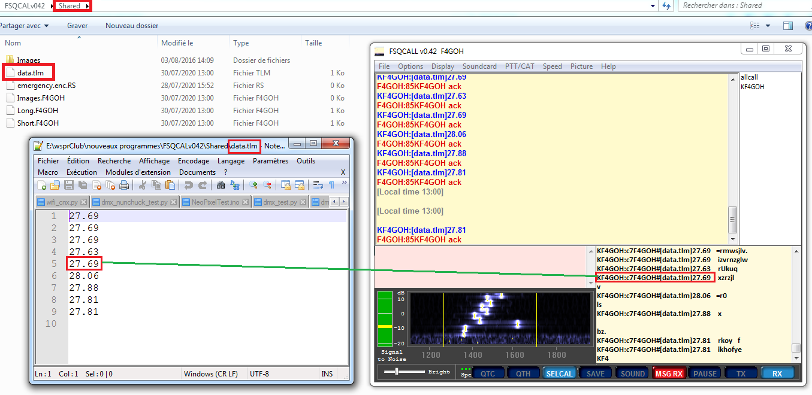

- Telemetry is saved into FSQCALv042\Shared\data.tlm
- File can be changed into FSQEncode.ino

73

Anthony

